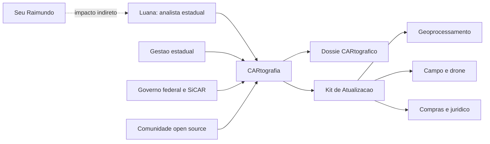

# Personas e Stakeholders

A CARtografia é desenhada primeiro para a analista ambiental estadual, mas só gera valor público se conversar com o ecossistema inteiro do CAR. A adoção depende de confiança técnica, clareza jurídica, integração institucional e governança aberta.

## Persona principal: Luana

Luana é analista ambiental estadual. Ela participa da análise, validação, correção ou priorização de cadastros do CAR. Seu trabalho exige convicção técnica e rastreabilidade, especialmente nos casos semiautomáticos.

| Dimensão | Descrição |
| --- | --- |
| Dores | Fila grande, bases defasadas, múltiplas fontes externas, sobreposições difíceis, falta de templates, insegurança sobre evidência suficiente. |
| Ganhos | Pré-validação, evidência integrada, menos consulta externa, minuta técnica editável, status claro de suficiência, rastreabilidade. |
| Incentivo de adoção | Reduzir tempo por caso sem perder controle humano sobre a decisão. |
| Objeção provável | Receio de caixa-preta ou de ferramenta que pressione decisões automáticas. |
| Resposta da CARtografia | IA como apoio, índice explicável, dossiê revisável e decisão humana no centro. |

## Beneficiário indireto: Seu Raimundo

Seu Raimundo é pequeno ou médio produtor rural. Ele não é o usuário principal da primeira versão, mas sente o impacto da demora e da falta de clareza na análise.

| Dimensão | Descrição |
| --- | --- |
| Dores | Demora no CAR, pedidos de retificação confusos, medo de sanções, dependência de terceiros, insegurança para crédito e políticas públicas. |
| Ganhos | Notificações mais precisas, menor retrabalho, mais previsibilidade e maior chance de avançar na regularização ambiental. |
| Incentivo de adoção | Receber orientações mais claras e decisões baseadas em evidência atual. |
| Objeção provável | Desconfiança sobre uso de dados territoriais sem explicação. |
| Resposta da CARtografia | Canal futuro de evidência territorial, linguagem clara e rastreabilidade dos fundamentos técnicos. |

## Mapa de stakeholders

| Stakeholder | Dores | Ganhos | Papel na adoção |
| --- | --- | --- | --- |
| Gestores estaduais | Pressão por volume, qualidade e transparência. | Métricas de fila, priorização e gargalos por camada. | Patrocinar piloto e definir camada prioritária. |
| Governo federal | Necessidade de interoperabilidade e reutilização. | Módulo aberto acoplável ao ecossistema do CAR. | Orientar padrões, APIs e governança nacional. |
| Equipes de geoprocessamento | Demandas incompletas e retrabalho. | Kits com recorte, fonte, critério técnico e prioridade. | Validar critérios de suficiência e QA. |
| Campo | Solicitações genéricas e pouco priorizadas. | Pontos de verificação, checklist e evidência esperada. | Coletar fotos, amostras e validações georreferenciadas. |
| Compras e jurídico | Escopos técnicos frágeis antes da contratação. | Minutas e critérios de aceite para instrução prévia. | Validar cautelas e rito de contratação. |
| Universidades | Dificuldade de conectar pesquisa ao fluxo público. | Ambiente de experimentação com dados e métricas. | Apoiar modelos, validação e avaliação independente. |
| Financiadores | Risco de financiar pilotos sem adoção. | Métricas de impacto e plano incremental. | Financiar MVP, piloto estadual e governança open source. |
| Comunidade open source | Falta de issues claras e arquitetura documentada. | Roadmap, conectores e padrões reutilizáveis. | Contribuir com código, documentação e integrações. |
| SiCAR, Dataprev, MGI e SFB | Necessidade de preservar arquitetura e segurança. | Camada complementar, modular e auditável. | Validar acoplamento, autenticação, eventos e limites. |

## Stakeholder map

