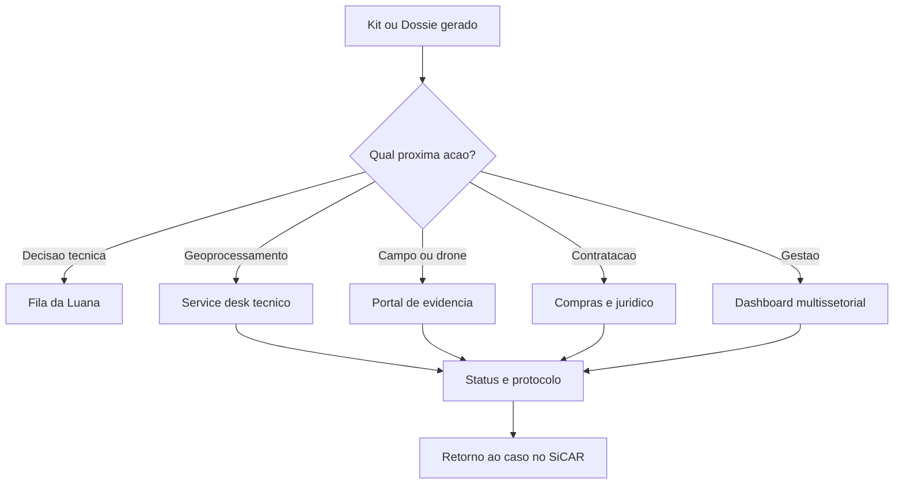

# Canal de Acionamento Institucional

A CARtografia também resolve um problema de comunicação. Não basta gerar dossiês e kits se eles ficarem parados em uma pasta, enviados por e-mail solto ou perdidos em conversas informais. O canal institucional garante que a demanda tenha dono, protocolo, prazo, status e histórico.

## Por que e-mail solto não basta

E-mail ajuda a comunicar, mas não estrutura fila, SLA, prioridade, anexos georreferenciados, versionamento nem retorno automático ao caso original. Em contexto público, a decisão precisa ser rastreável e a demanda precisa sobreviver à troca de pessoas, setores e sistemas.

## Cinco camadas do canal

| Camada | Função | Exemplo de saída |
| --- | --- | --- |
| Notificações integradas na fila da Luana | Mostrar status, prioridade, próxima ação e responsável. | "Kit enviado para geoprocessamento, aguardando triagem." |
| Webhook/API para protocolo ou service desk | Abrir demanda formal com metadados estruturados. | Protocolo, anexos e retorno de status. |
| Portal móvel de evidência territorial | Coletar foto georreferenciada, observação e evidência de campo. | Registro de vistoria com coordenada e data. |
| Gatilho de preparação contratual | Encaminhar Kit com escopo, justificativa e critérios técnicos. | Minuta para termo de referência ou cooperação. |
| Dashboard multissetorial | Dar visão para gestão, compras, campo e geoprocessamento. | Fila por camada, SLA, gargalos e taxa de aceite. |

## Fluxo

## Estados do canal

| Status | Significado |
| --- | --- |
| Aberto | Kit gerado e demanda criada. |
| Em triagem | Setor responsável avaliando completude. |
| Aceito | Demanda tecnicamente adequada para execução. |
| Complementação solicitada | Faltam dados, anexos ou justificativa. |
| Em execução | Campo, geoprocessamento ou contratação em andamento. |
| Concluído | Entrega aceita e vinculada ao caso. |
| Encerrado sem execução | Decisão institucional registrada com motivo. |

## Evolução futura para o produtor

O produtor rural pode participar em uma etapa futura por um canal de evidência territorial, com linguagem simples e envio controlado de fotos ou documentos. Essa evolução deve ser posterior ao fluxo de análise semiautomática, para não deslocar o foco inicial da CARtografia.

## Princípio de governança

O canal não é uma rede social interna nem um chat avulso. Ele é uma trilha institucional de encaminhamento. Cada acionamento deve ter responsável, prazo, anexos, status e justificativa.
