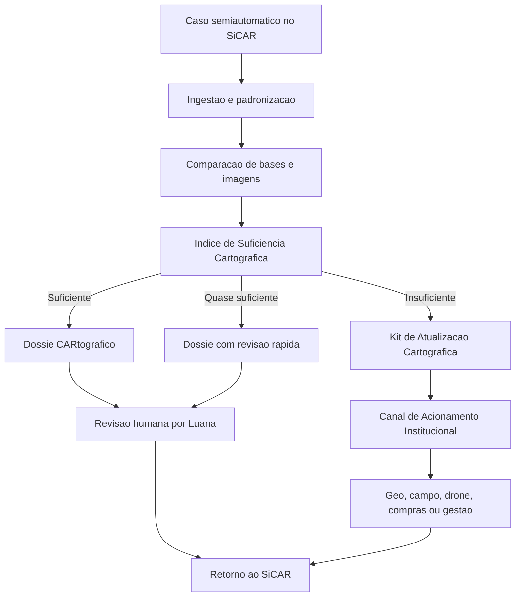

# Produto e Funcionamento

A CARtografia funciona como uma camada de triagem e instrução cartográfica para casos semiautomáticos do SiCAR. O produto organiza dados, calcula suficiência, gera artefatos técnicos e aciona o próximo setor quando a base não permite decisão segura.

## Módulos

| Módulo | Função | Saída |
| --- | --- | --- |
| Ingestão de dados | Recebe camadas do SiCAR, bases públicas, imagens e bases estaduais autorizadas. | Pacote geoespacial versionado. |
| Padronização | Normaliza projeção, metadados, datas, fonte e qualidade mínima. | Camadas comparáveis e auditáveis. |
| Integração com SiCAR | Recebe eventos de casos semiautomáticos e devolve status. | Registro de processamento e anexos. |
| Índice de Suficiência Cartográfica | Avalia atualidade, confiabilidade, completude e divergência. | Status de suficiência e justificativa. |
| Dossiê CARtográfico | Monta evidência quando a base é suficiente ou quase suficiente. | Artefato técnico revisável. |
| Kit de Atualização Cartográfica | Prepara demanda quando a base é insuficiente. | Pacote para campo, drone, geoprocessamento ou contratação. |
| Canal de Acionamento Institucional | Encaminha dossiê ou kit com dono, SLA e histórico. | Demanda protocolada ou registrada. |
| Templates e minutas | Padroniza parecer, despacho, termo de referência e QA. | Texto editável com campos preenchidos. |
| Evidência territorial | Permite evolução futura com foto georreferenciada e coleta móvel. | Evidência complementar validável. |
| Dashboard de status | Mostra gargalos por camada, município, equipe e etapa. | Gestão de fila e priorização. |
| Exportação/publicação | Gera anexos, changelog e retorno para sistemas autorizados. | Pacote final rastreável. |
| Logs e auditoria | Registra fonte, versão, usuário, status e decisão humana. | Trilha de auditoria. |

## Fluxo de funcionamento

## Experiência de Luana

Luana não precisa alternar entre vários sistemas para reconstruir uma evidência básica. Ao abrir um caso, ela vê o status de suficiência, as camadas comparadas, fatores de confiança, fatores de alerta e a recomendação operacional.

Se a suficiência for alta, ela revisa o Dossiê CARtográfico, ajusta a minuta técnica e registra a decisão. Se a suficiência for baixa, ela envia o Kit de Atualização Cartográfica para o canal adequado, mantendo o caso rastreável.

## Princípios de produto

1. A decisão continua humana.
2. Todo resultado precisa explicar por que foi produzido.
3. Cada recomendação deve virar ação institucional, não apenas visualização.
4. Toda base usada precisa ter fonte, data, versão e limitação.
5. O sistema deve funcionar por camadas e estados, sem exigir implantação nacional imediata.
