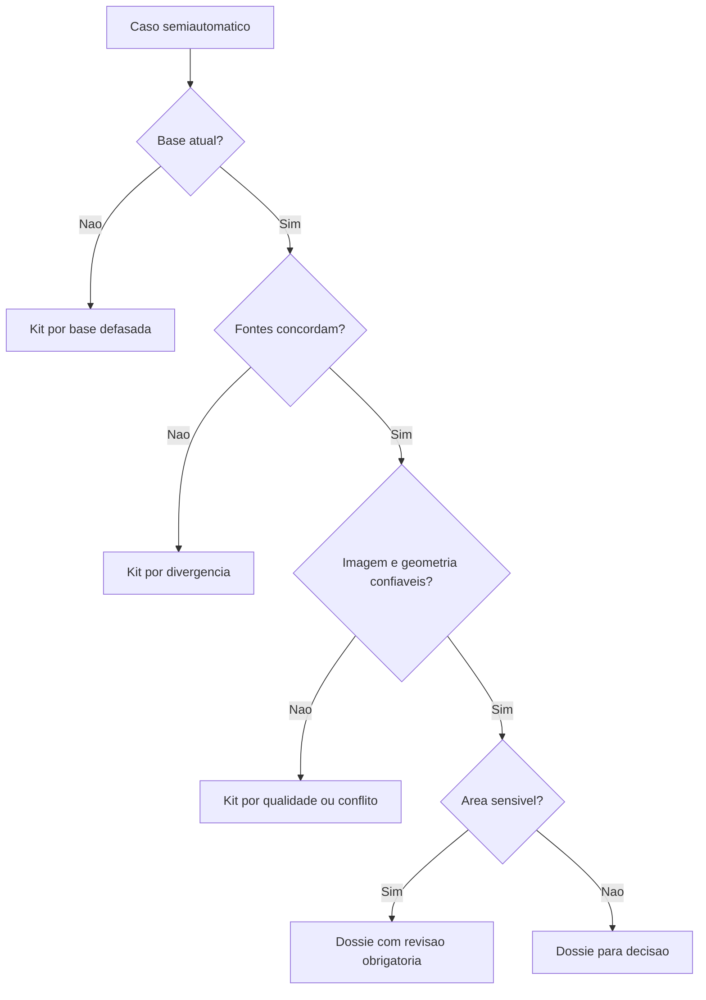

# Índice de Suficiência Cartográfica

Suficiência cartográfica é a condição mínima para que uma base geoespacial apoie uma decisão técnica com segurança razoável. Não significa certeza absoluta nem automação da decisão. Significa que a base disponível é atual, confiável, completa e coerente o bastante para que Luana possa revisar e decidir sem reconstruir manualmente toda a evidência.

:::info Pergunta fundamental
Antes de perguntar "qual é a decisão?", a CARtografia pergunta "a base é suficiente para decidir?".
:::

## Dimensões avaliadas

| Dimensão | Critérios | Sinal de alerta | Saída possível |
| --- | --- | --- | --- |
| Atualidade | Data da imagem, data da camada, intervalo desde a última atualização. | Base com dois anos ou mais, dependendo da camada e do estado. | Insuficiente por base defasada. |
| Confiabilidade | Fonte, método, resolução, metadados e histórico de uso. | Fonte sem metadado ou método não documentado. | Suficiente com revisão rápida. |
| Concordância | Coerência entre SiCAR, bases estaduais, MapBiomas, INPE, SNIF e outras fontes. | Divergência relevante entre fontes. | Insuficiente por divergência. |
| Qualidade visual | Nuvens, sombra, resolução, sazonalidade e ruído. | Baixa qualidade de imagem. | Insuficiente por baixa qualidade. |
| Relevância legal | APP, Reserva Legal, uso restrito, áreas consolidadas e remanescentes. | Interseção sensível ou proximidade de camada protegida. | Revisão humana obrigatória. |
| Geometria | Sobreposição, conflito de polígonos, deslocamento e consistência topológica. | Conflito geométrico. | Insuficiente por conflito. |
| Evidência de campo | Foto georreferenciada, vistoria, drone ou validação anterior. | Ausência de evidência em área crítica. | Insuficiente por necessidade de campo. |
| Histórico | Reaberturas, revisões anteriores e decisões relacionadas. | Caso recorrente sem solução estrutural. | Kit de atualização ou governança. |

## Cálculo conceitual

O índice pode ser implementado como composição ponderada por camada e contexto. A primeira versão não precisa prometer um modelo estatístico fechado. Ela pode usar regras transparentes, pesos configuráveis e justificativas legíveis.

Exemplo conceitual:

| Fator | Pergunta | Peso inicial sugerido |
| --- | --- | --- |
| Atualidade | A base representa o período necessário para decidir? | Alto |
| Confiabilidade | A fonte é oficial, pública ou tecnicamente reconhecida? | Alto |
| Concordância | Fontes independentes apontam para a mesma interpretação? | Médio |
| Qualidade da imagem | A evidência visual permite comparação? | Médio |
| Sensibilidade ambiental | A área envolve APP, RL ou uso restrito? | Alto |
| Validação complementar | Há evidência de campo ou histórico confiável? | Variável |

## Status de saída

| Status | Quando usar | Próxima ação |
| --- | --- | --- |
| Suficiente para decisão | Evidência coerente, atual e relevante. | Gerar Dossiê CARtográfico. |
| Suficiente com revisão rápida | Há pequena incerteza, mas o caso é tratável. | Gerar dossiê com pontos de atenção. |
| Insuficiente por base defasada | A data da base compromete a decisão. | Gerar Kit de Atualização Cartográfica. |
| Insuficiente por divergência | Fontes indicam interpretações incompatíveis. | Encaminhar para geoprocessamento ou campo. |
| Insuficiente por baixa qualidade | Imagem ruim, nuvem, sombra ou resolução inadequada. | Buscar nova imagem ou levantamento. |
| Insuficiente por necessidade de campo | Evidência remota não resolve a dúvida. | Acionar vistoria, foto georreferenciada ou drone. |
| Insuficiente por conflito geométrico | Polígonos ou camadas estão incompatíveis. | Acionar correção técnica. |
| Insuficiente por dependência estadual | Atualização depende de base estadual formal. | Acionar gestão, compras ou cooperação técnica. |

## Árvore de decisão

## Limites

O índice não decide, não sanciona, não substitui vistoria e não elimina a necessidade de interpretação jurídica. Ele reduz incerteza e explicita quando a evidência não é suficiente. A decisão final permanece com a analista e com a instituição competente.
