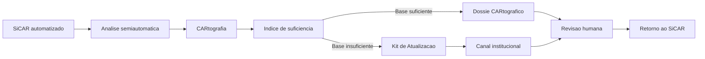

# Acoplamento ao SiCAR

A CARtografia é um módulo acoplável, não uma substituta do SiCAR. Ela deve operar ao lado da infraestrutura existente, respeitando regras de acesso, governança estadual, segurança, sigilo quando aplicável e a competência das equipes públicas.

O CAR é um registro público eletrônico nacional previsto no Código Florestal, e o SiCAR é a infraestrutura que organiza a inscrição, consulta, análise e regularização ambiental em articulação com os entes federativos. A proposta da CARtografia é fortalecer esse ecossistema com uma camada de suficiência cartográfica para casos semiautomáticos.

## Onde entra no fluxo

## Entradas vindas do SiCAR

| Entrada | Uso na CARtografia | Cautela |
| --- | --- | --- |
| Identificador do caso | Rastreamento e retorno de status. | Não expor dados pessoais sem base legal. |
| Geometria do imóvel ou área | Recorte espacial e comparação de camadas. | Controlar acesso e versão. |
| Camadas declaradas | Comparação com bases de referência. | Separar declaração do produtor de evidência observada. |
| Motivo da queda para semiautomática | Priorização do tipo de análise. | Preservar regra de negócio do SiCAR. |
| Histórico de análise | Evitar retrabalho e explicar recorrência. | Auditar autoria e data. |

## Saídas devolvidas ao SiCAR

| Saída | Formato recomendado | Finalidade |
| --- | --- | --- |
| Status de suficiência | Código estruturado e justificativa textual. | Indicar próxima ação. |
| Dossiê CARtográfico | PDF/HTML e JSON de metadados. | Apoiar parecer e revisão. |
| Kit de Atualização | Pacote com anexos, recorte e critérios. | Acionar geoprocessamento, campo ou contratação. |
| Logs de processamento | Evento auditável. | Rastreabilidade e controle interno. |
| Decisão humana | Registro assinado ou validado pela analista. | Preservar responsabilidade institucional. |

## Níveis de integração

1. Simulação para hackathon: upload manual de recortes fictícios ou anonimizados, sem acesso real ao SiCAR.
2. Integração leve: exportação e importação por arquivos estruturados, com camada única e ambiente controlado.
3. Webhook/API estadual: envio de eventos, anexos e status para protocolo ou service desk.
4. Fila de eventos: processamento assíncrono por lotes, com logs e retry.
5. Acoplamento operacional: retorno direto de dossiês, kits e decisões ao ambiente autorizado do SiCAR.

## Segurança e controle de acesso

A integração deve partir do princípio de menor privilégio. Usuários veem apenas casos e camadas necessários ao seu papel. Bases sensíveis, dados pessoais e documentos de análise devem ser protegidos por autenticação, autorização, logs, retenção definida e trilhas de auditoria.

:::caution Cautela
A CARtografia não deve replicar bases internas do SiCAR em ambientes públicos. No protótipo, usar dados fictícios, públicos ou anonimizados. Em produção, operar com contratos, termos de uso, perfis de acesso e governança formal.
:::

## Riscos de integração

| Risco | Mitigação |
| --- | --- |
| Quebrar regras de negócio do SiCAR | Integração somente por APIs/eventos definidos com as equipes responsáveis. |
| Duplicar decisões ou criar plataforma paralela | Retorno obrigatório ao fluxo oficial e marcação clara de artefato de apoio. |
| Expor dados pessoais | LGPD, minimização, anonimização no piloto e controle de acesso. |
| Travar implantação por escopo nacional | Piloto por estado, camada e fluxo limitado. |
| Criar dependência de fornecedor | Código aberto, documentação, formatos abertos e governança comunitária. |

## Fontes de apoio

- [Serviço CAR no gov.br](https://www.gov.br/pt-br/servicos/inscrever-imovel-rural-no-cadastro-ambiental-rural-car)
- [Catálogo de APIs governamentais: SICAR Tema](https://www.gov.br/conecta/catalogo/apis/sicar-tema)
- [Lei nº 12.651/2012, Código Florestal](https://www.planalto.gov.br/ccivil_03/_ato2011-2014/2012/lei/l12651.htm)
- [Decreto nº 7.830/2012, SiCAR e CAR](https://www.planalto.gov.br/ccivil_03/_ato2011-2014/2012/decreto/d7830.htm)
