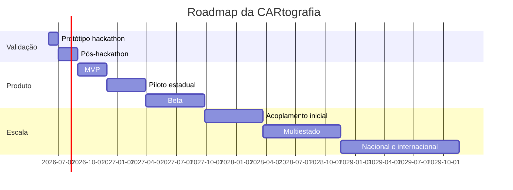

# Roadmap

O roadmap da CARtografia deve proteger a equipe de dois riscos: tentar acoplar tudo ao SiCAR cedo demais ou ficar presa em uma demonstração sem aprendizado operacional. A estratégia é evoluir por fases, sempre medindo tempo economizado, qualidade do artefato e aceitação institucional.

| Fase | Objetivos | Entregáveis | Usuários | Métricas | Riscos |
| --- | --- | --- | --- | --- | --- |
| Protótipo hackathon | Explicar problema, solução e fluxo. | Documentação, exemplos fictícios, diagramas e pitch. | Jurados, mentores e equipe. | Clareza da proposta e aderência ao Desafio 2. | Parecer genérico ou prometer automação demais. |
| MVP | Validar índice, dossiê e kit com dados simulados. | Motor de regras inicial, templates e dashboard simples. | Analistas convidadas. | Tempo simulado por caso e feedback qualitativo. | Critérios de suficiência pouco explicáveis. |
| Piloto estadual | Testar camada prioritária em ambiente controlado. | Fluxo com casos anonimizados, integração leve e canal mínimo. | Luana, geoprocessamento e gestão. | Consultas externas evitadas e taxa de aceite dos Kits. | Falta de dados, agenda institucional ou adesão. |
| Beta | Operar com mais casos e métricas. | Logs, QA, capacitação e backlog público. | Órgão estadual e equipe técnica. | Taxa de reabertura, SLA e satisfação. | Sobrecarga operacional e baixa qualidade de metadados. |
| Acoplamento inicial ao SiCAR | Integrar eventos e retornos em ambiente autorizado. | APIs, webhooks, controle de acesso e trilha de auditoria. | SiCAR, estado e analistas. | Eventos processados e retornos sem falha. | Segurança, governança e dependência de sistemas legados. |
| Multiestado | Replicar com adaptações locais. | Playbook, conectores e governança comunitária. | Estados pilotos. | Número de estados e conectores abertos. | Customizações incompatíveis entre estados. |
| Nacional | Consolidar padrões e suporte. | Catálogo nacional de conectores, métricas agregadas e governança madura. | Governo federal e estados. | Adoção, disponibilidade e impacto público. | Complexidade federativa e financiamento recorrente. |
| Internacionalização | Adaptar o modelo a outros países. | Documentação multilíngue, arquitetura de referência e casos de uso. | Governos e financiadores. | Projetos de cooperação e reuso. | Diferenças legais, ambientais e cadastrais. |

## Linha do tempo sugerida

## Critério para avançar de fase

Cada fase deve avançar apenas quando houver evidência mínima: usuários validaram o fluxo, artefatos foram aceitos, riscos jurídicos foram mapeados e métricas mostram ganho operacional.
